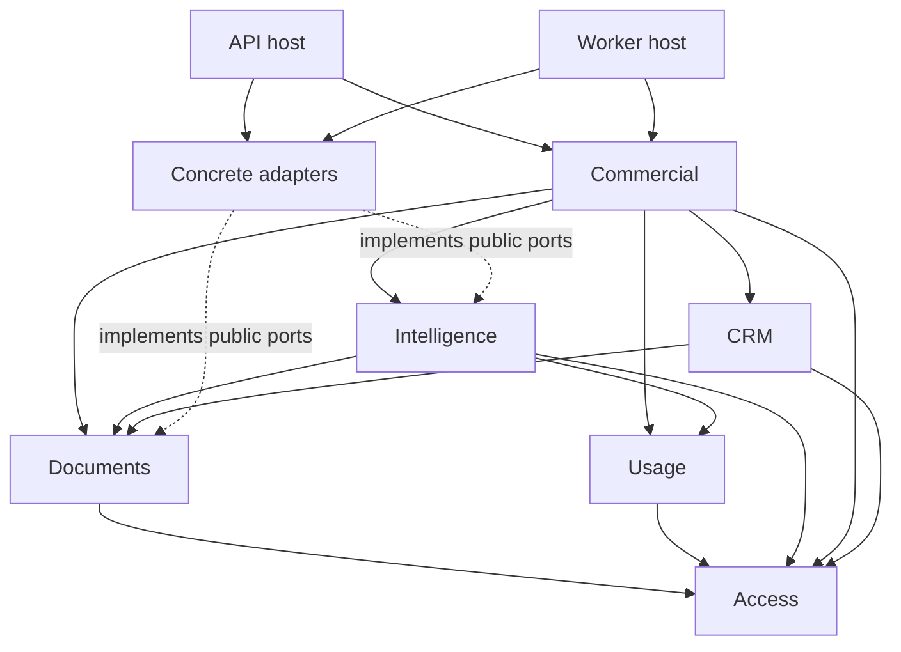

# Public package dependency rules

Status: design contract; enforcement pending source implementation.

## Allowed direct business imports

| Consumer | Allowed public business dependencies |
|---|---|
| access | None |
| documents | access |
| usage | access |
| intelligence | access, documents, usage |
| CRM | access, documents |
| commercial | access, documents, intelligence, CRM, usage |
| adapters | Public ports/value types of the business packages it implements |
| API and worker | Required public business interfaces and concrete adapters |

Each declared dependency has a purpose: access supplies principal/policy values; documents supplies identity/evidence metadata and authorized commands; intelligence supplies evidence/consultation operations; CRM supplies commercial-record commands; usage supplies attempt/receipt attribution. Commercial coordinates the product action. Dependencies do not grant direct table access.

No package below commercial calls commercial back. Business packages do not import adapters, applications, concrete provider SDKs or another package's private implementation. Adapters never invoke a host as their policy authority. Applications do not import one another.

The diagram shows principal relationships, not every permitted host/adapter edge. The table is authoritative. Runtime invocation through injected ports is dependency inversion; documents does not import adapters merely because an adapter performs its persistence.

## Frontend and contract edges

Web can import public `@agr/api-client` and `@agr/ui`. UI imports neither client nor application features. API client imports neither React feature state nor UI. Neither TS package imports Python domain source. Contract artifacts connect the language boundaries.

API schema generation precedes api-client generation; client/UI builds precede dependent web checks. Event schemas have their own canonical authority. Avoid a cross-language business-model package that creates two competing validation implementations.

## Enforcement and exception rules

Declare manifest dependencies; verify Python import contracts and JS public exports; forbid private deep imports; build/test each package with only its declared dependencies. Root affected checks include explicit Python/schema/migration dependencies.

Any new edge needs a concrete use case and an acyclic graph. If it introduces a cycle, change coordination/port ownership rather than adding a blanket import exception. Do not extract a shared kernel solely to eliminate a repeated small value type.
